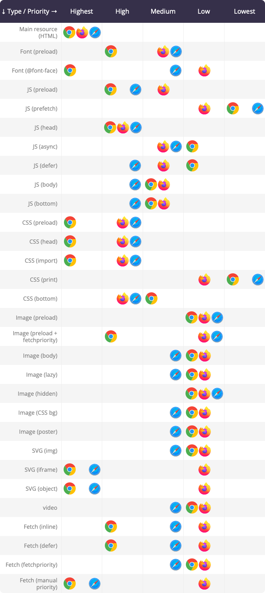

# Browser prioritization test December 2022

This test was done by hosting [this test page](https://github.com/http3-prioritization/prioritization-test-page) on a [custom version of aioquic](https://github.com/http3-prioritization/aioquic) that has qlog support for the `PRIORITY_UPDATE` frames. 

The qlogs were then added here as .js files (makes them easier to load locally) and processed using the `analyze.html` file. 

The high-level interpreted results (in `results.html`) look like this:

For low-level raw results, open `analyze.html` locally and look in the console output. 